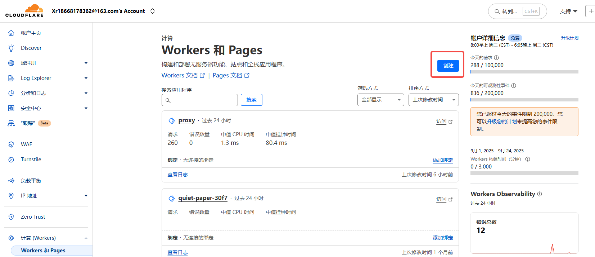
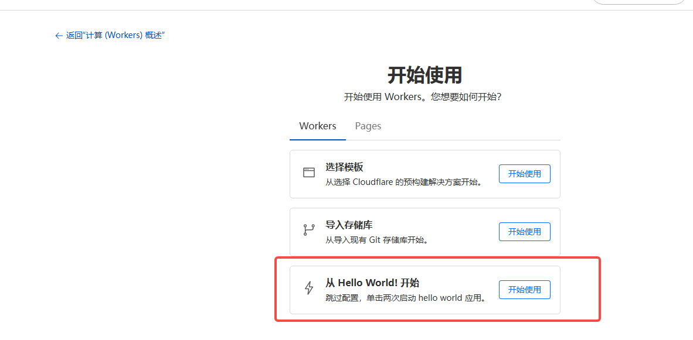
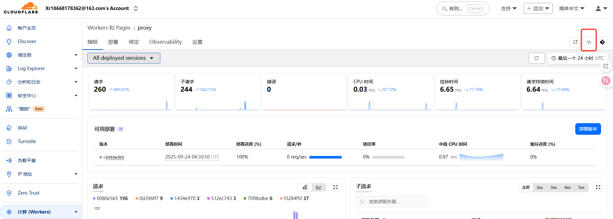
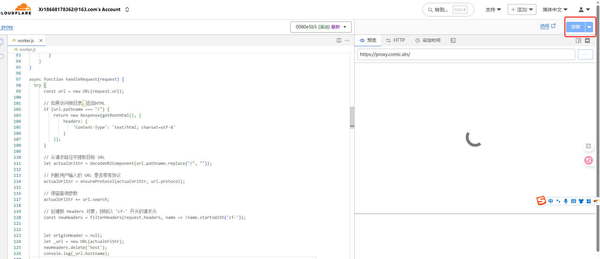
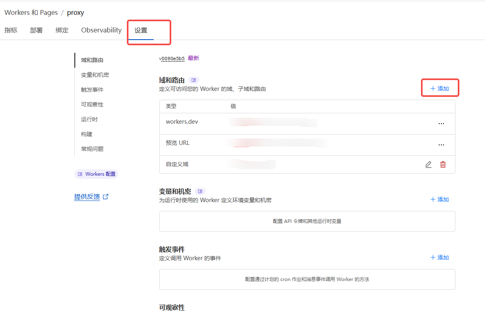
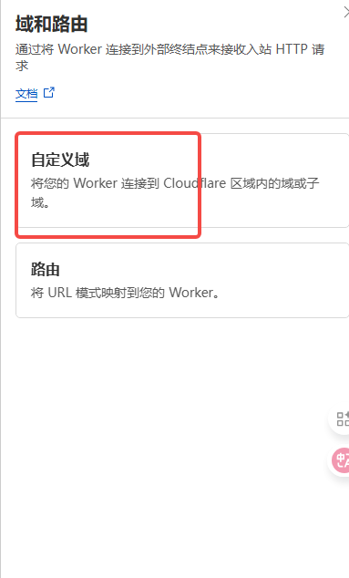
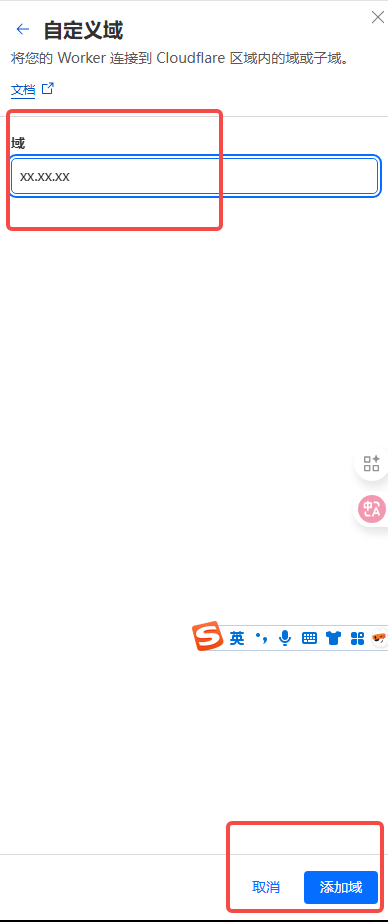

## 添加方式
1. 先在cloudflare上面拥有一个域名，请自行搜索教程
2. 进入worker也能，点击创建

3. 点击“从 Hello World! 开始”旁边的按钮

4. 取个名字，点击部署
5. 点击代码

6. copy代码
- [代码](./反代程序/proxy.js)
7. 点击部署

8. 进入设置，添加一个自定义域

9. 填入的域名放到配置ProxyUrl

注意： 这个域名为参数: ProxyUrl 的值，记得加入https://域名