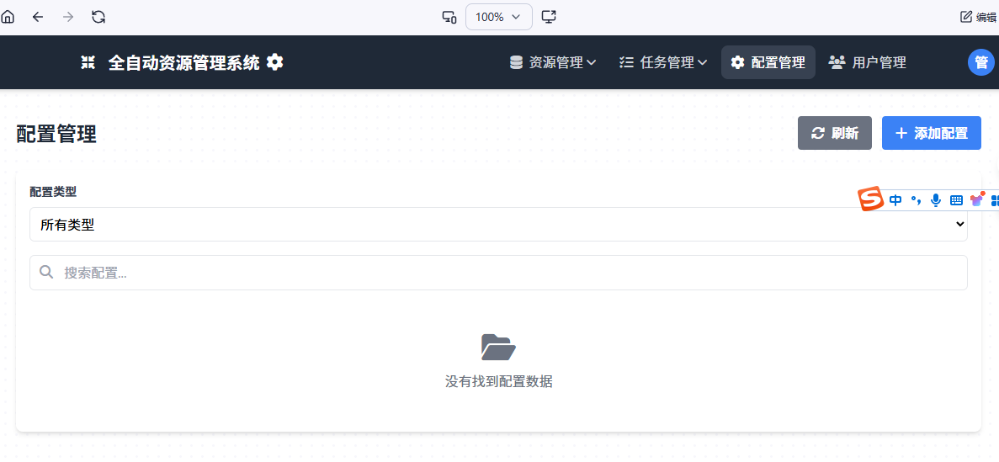

在进行正式的操作之前，你需要配置这些东西

## TMDB API
请进入 https://www.themoviedb.org/settings/api  申请一个，或者你可以找其他的小伙伴公用一个
作者由于有大量的数据，为了体验，所以不进行分享

## AI 模型秘钥
我们已经支持了这些平台， 你需要从这些平台拿到api_key以及model_name，并且他是可用的
- 百炼平台
- 火山平台
- 千帆平台
- 百川平台
- 智普平台
- 腾讯平台
- openrouter平台
- 讯飞平台

## 豆瓣 COOKIE
我们支持了豆瓣的刮削，所以你最好配置一下豆瓣的Cookie

## 云盘账号
123平台或者189平台，后续会提供更多的平台

## 配置路径
进入这个页面进行配置

[189账号配置说明](/其他/189网盘配置说明.md)
[AI平台配置说明](/其他/AI平台配置说明.md)
